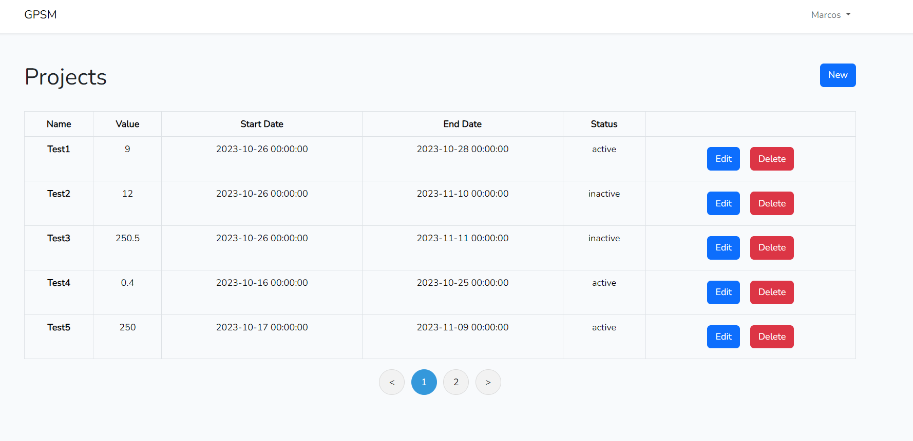
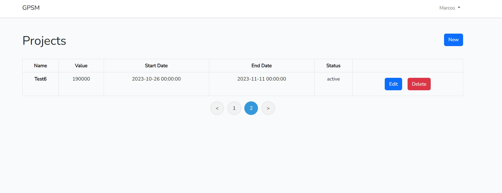
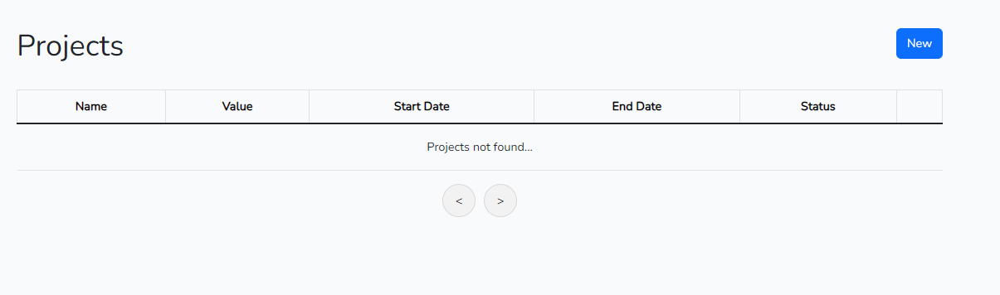
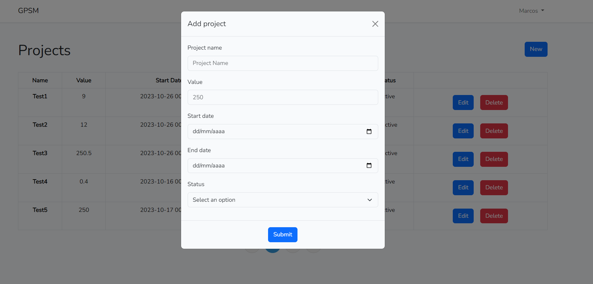
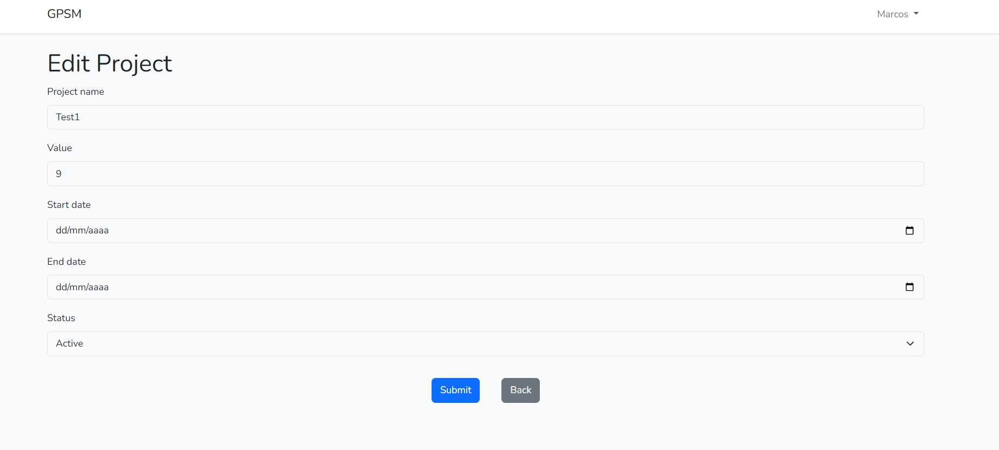
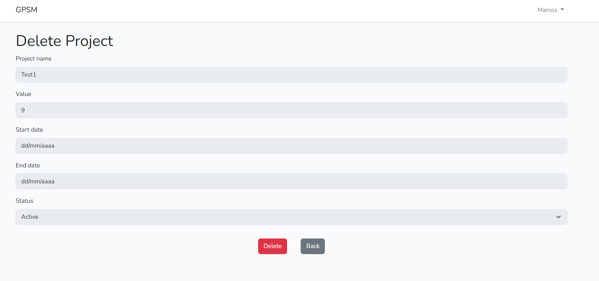

<h1 align="center"> GPMS </h1>

## Setup
- PHP (_Laravel_)
- MySQL
- VueJs

## Install
1. Clone the repository
```
$ git clone  https://github.com/MarcosOlvr/gpms
```

2. Access the folder
```
$ cd gpms
```

3. Install PHP libraries
```
$ composer install
```

4. Install VueJs dependencies
```
$ npm i
```

### Migrations
1. Remember to change the DB infos in the .env file
2. Running migration
```
$ php artisan migrate
```
3. Running seeders
```
$ php artisan db:seed
```
### Run the app
``` 
$ php artisan serve
```
``` 
$ npm run dev
```

## Endpoints

### Get project
_GET /{project_id}_

### Get list of projects
_GET /list_

_GET /list?page={page}_

### Create project
_POST /store_

### Update project
_PUT /update/{project}_

### Delete project
_DELETE /delete/{project}_

## Frontend

### Project list


If you don't have a project 


### Create a project


### Edit a project


### Delete a project
